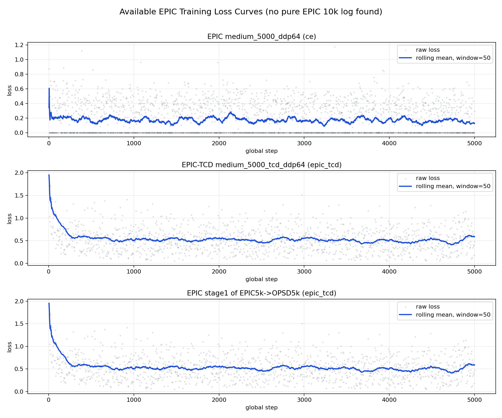

# Available EPIC Loss Curves

No pure EPIC 10k `training_log.jsonl` was found under `outputs/visionzip_aokvqa_reasoning/checkpoints/epic`. The longest available EPIC logs end at step 5000, so this report plots the available EPIC 5k runs.

| Run | Loss type | Points | Steps | First100 mean | Last100 mean | Ratio | Final rolling50 | Max | P95 |
|---|---|---:|---:|---:|---:|---:|---:|---:|---:|
| EPIC medium_5000_ddp64 | ce | 2500 | 2-5000 | 0.2034 | 0.1274 | 0.6266 | 0.1298 | 1.1753 | 0.5482 |
| EPIC-TCD medium_5000_tcd_ddp64 | epic_tcd | 1250 | 4-5000 | 0.6722 | 0.5240 | 0.7795 | 0.5904 | 1.9521 | 1.0096 |
| EPIC stage1 of EPIC5k->OPSD5k | epic_tcd | 1250 | 4-5000 | 0.6723 | 0.5229 | 0.7777 | 0.5883 | 1.9521 | 1.0097 |

Source logs:
- `/project/6101803/enmingzz/outputs/visionzip_aokvqa_reasoning/checkpoints/epic/medium_5000_ddp64/training_log.jsonl`
- `/project/6101803/enmingzz/outputs/visionzip_aokvqa_reasoning/checkpoints/epic/medium_5000_tcd_ddp64/training_log.jsonl`
- `/project/6101803/enmingzz/outputs/visionzip_aokvqa_reasoning/checkpoints/epic/epic_then_opsd_10000_50_50_stage1_epic5000/training_log.jsonl`
