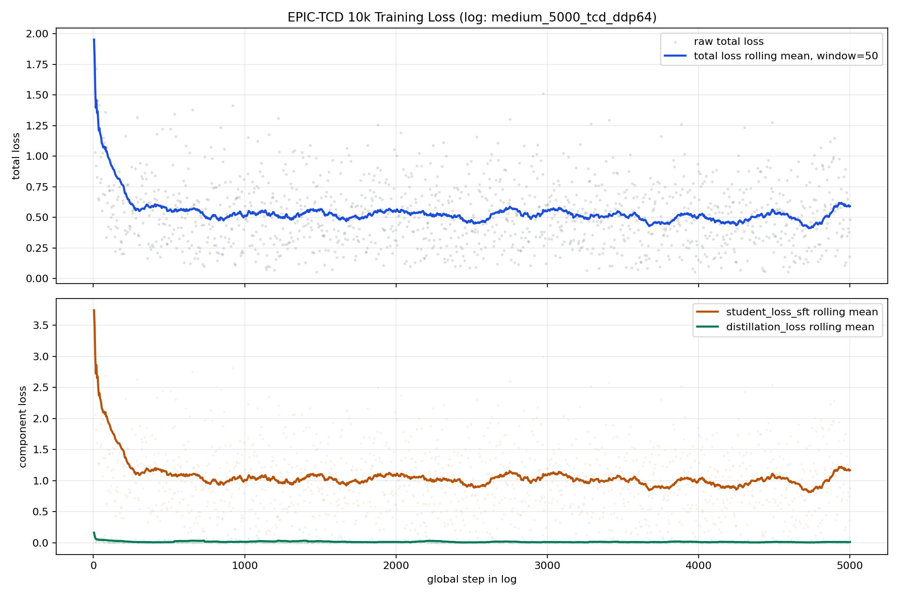

# EPIC-TCD 10k Loss Curve

- Source log: `/project/6101803/enmingzz/outputs/visionzip_aokvqa_reasoning/checkpoints/epic/medium_5000_tcd_ddp64/training_log.jsonl`
- Rank-0 log points: `1250`
- Step field: `4-5000`
- World size: `4`
- Loss type: `epic_tcd`

| Metric | Value |
|---|---:|
| First 100 total-loss mean | 0.6722 |
| Last 100 total-loss mean | 0.5240 |
| Last/first ratio | 0.7795 |
| Final total loss | 0.4810 |
| Final rolling50 total loss | 0.5904 |
| P95 total loss | 1.0096 |
| Max total loss | 1.9521 |

## By Retention Ratio

| Retention | Points | Mean total | Last100 mean total | Mean SFT component | Mean distill component |
|---:|---:|---:|---:|---:|---:|
| 0.1 | 313 | 0.5669 | 0.5460 | 1.1000 | 0.0338 |
| 0.2 | 298 | 0.5147 | 0.4750 | 1.0147 | 0.0147 |
| 0.3 | 314 | 0.5097 | 0.4845 | 1.0113 | 0.0082 |
| 0.4 | 325 | 0.5194 | 0.4765 | 1.0310 | 0.0078 |
